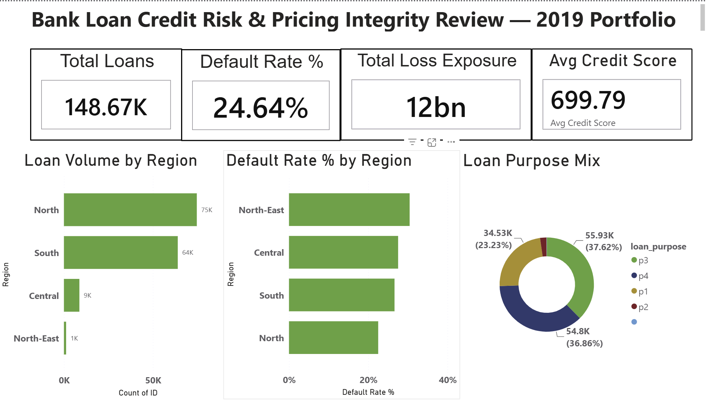

# Bank Loan Credit Risk & Pricing Integrity Review — 2019 Portfolio

[](https://www.microsoft.com/en-us/sql-server)
[](https://powerbi.microsoft.com/)
[](https://www.kaggle.com/)

## Project Overview

An independent credit risk review commissioned to interrogate the 2019 loan portfolio of a mortgage bank across **148,670 loans** and **$11.7B in total loss exposure**. The analysis tests three hypotheses using SQL Server for data engineering and analysis, and Power BI for a 5-page executive dashboard.

This project replicates the structure of a Big 4 consulting risk engagement — every cleaning decision is documented, every query is hypothesis-mapped, and findings are delivered through a boardroom-ready executive summary.


 
---

## Business Problem

The CRO commissioned an independent review to answer three questions:

| # | Hypothesis | Question |
|---|---|---|
| H1 | Credit Scoring Model Integrity | Is the credit scoring model actually predicting default — or are high-score borrowers defaulting at the same rate as low-score ones? |
| H2 | Regional Rate Mispricing | Are identical-risk borrowers being charged different rates by region — and is the cheapest region actually the riskiest? |
| H3 | Hidden Stress Exposure | Are high-LTV, low-income borrowers carrying disproportionate default risk invisible in the headline 24.64% default rate? |

---

## Key Findings

| Hypothesis | Verdict | Evidence |
|---|---|---|
| H1 | ✅ CONFIRMED | Default rate varies only **1.25pp** across a 400-point score range. The highest score band (850-900) defaults at **25.31%** — higher than the lowest band (500-549) at **24.55%**. Model has no predictive power. |
| H2 | ✅ CONFIRMED | South region charged the **cheapest rate (4.04%)** but carries the **second highest default rate (26.63%)** — 4.12pp above the safest region North (22.51%). Risk is systematically underpriced. |
| H3 | ✅ CONFIRMED | Default rate explodes past 100% LTV — **80.59%** at 100-120% LTV and **99.93%** above 120%. A 10% income shock puts **$7.06B** of currently performing loans at risk of breaching 50% DTI. |

---
## Dashboard Preview


---

## Portfolio KPIs

| Metric | Value |
|---|---|
| Total Loans Reviewed | 148,670 |
| Portfolio Default Rate | 24.64% |
| Total Loss Exposure | $11.7B |
| Avg Credit Score | 699 |
| Avg LTV | 73.26% |
| Avg Interest Rate | 4.05% |
| Avg DTI | 37.73% |
| Avg Income | $6,885 |

---

## Tools & Technologies

| Tool | Purpose |
|---|---|
| SQL Server / SSMS | Database setup, raw staging, data cleaning, EDA, 10 analytical queries, 2 views, 1 stored procedure |
| Power BI Desktop | Star schema (1 fact + 6 dim tables), 6 DAX measures, 5-page executive dashboard |
| T-SQL | CTEs, window functions (NTILE, ROW_NUMBER, PERCENTILE_CONT), BULK INSERT, BCP export |
| DAX | Default Rate %, Total Loss Exposure, Avg Interest Rate, Avg LTV, H1 Spread, At-Risk Exposure |

---

## Project Structure

```
bank-loan-credit-risk-review/
├── README.md
├── DATA_DICTIONARY.md
├── KEY_FINDINGS.md
├── .gitignore
├── sql/
│   └── Phase2_SQL_Analysis.sql
├── powerbi/
│   └── BankLoanCreditRisk.pbix
├── data/
│   ├── Loan_Default.csv
│   └── Clean_LoanData.csv
└── screenshots/
    ├── 01_portfolio_overview.png
    ├── 02_h1_credit_score.png
    ├── 03_h2_rate_mispricing.png
    ├── 04_h3_stress_exposure.png
    └── 05_executive_summary.png
```

---

## SQL Phase — What Was Built

The SQL script (`Phase2_SQL_Analysis.sql`) is structured as a complete, reproducible pipeline:

1. **Database Setup** — `BankLoanCreditRisk` database created from scratch
2. **Raw Staging Table** — `dbo.Raw_LoanData` mirrors the source CSV 1:1 (audit trail)
3. **BULK INSERT** — 148,670 rows imported via T-SQL script (fully reproducible)
4. **Data Cleaning** — `dbo.Clean_LoanData` created with regional median imputation, casing standardisation, LTV recalculation, and 4 derived columns (`LTV_clean`, `LTV_reliability_flag`, `credit_score_band`, `LTV_band`)
5. **Standalone EDA** — KPI reconciliation confirming SQL matches expected population
6. **10 Analytical Queries** — 3 for H1, 4 for H2, 3 for H3 — each using CTEs and window functions
7. **2 Reusable Views** — `vw_CreditScoreModelIntegrity` (H1), `vw_RegionalPricingRisk` (H2)
8. **Executive Stored Procedure** — `usp_ExecutiveRiskBriefing` — one call returns verdicts on all 3 hypotheses with income shock simulation

---

## Power BI Phase — Dashboard Pages

| Page | Title | Content |
|---|---|---|
| 1 | Portfolio Overview | 4 KPI cards, loan volume by region, default rate by region, loan purpose mix |
| 2 | Is the Credit Scoring Model Working? (H1) | Default rate by band bar chart, risk rank table, 1.25pp spread verdict card |
| 3 | Is Risk Mispriced by Region? (H2) | Rate vs default by region charts, mispricing gap table, South underpricing callout |
| 4 | Where is the Hidden Stress? (H3) | Default rate by LTV band, loss exposure by LTV band, income shock what-if slicer |
| 5 | Executive Summary — Risk Verdicts | 3 verdict cards (H1/H2/H3 CONFIRMED), key numbers, recommended actions |

---

## Data Source

**Dataset:** [Loan Default — Kaggle](https://www.kaggle.com/)
**Rows:** 148,670
**Columns:** 34
**Year:** 2019

---

## Recommended Actions

1. **H1** — Commission a full credit model review. The current model provides no differentiation across a 400-point score range and cannot be used for risk-based pricing.
2. **H2** — Reprice South region loans upward immediately. The South carries 26.63% default risk at the cheapest rate in the portfolio — a structural mispricing that is transferring risk to the bank.
3. **H3** — Place all loans above 100% LTV on enhanced monitoring. A 10% income shock alone puts $7.06B of currently performing loans at risk of breaching 50% DTI.

---

## Author

**Shabab Tahsin**
Business Data Analyst | SQL · Power BI · Python
[GitHub](https://github.com/shababtahsin)
