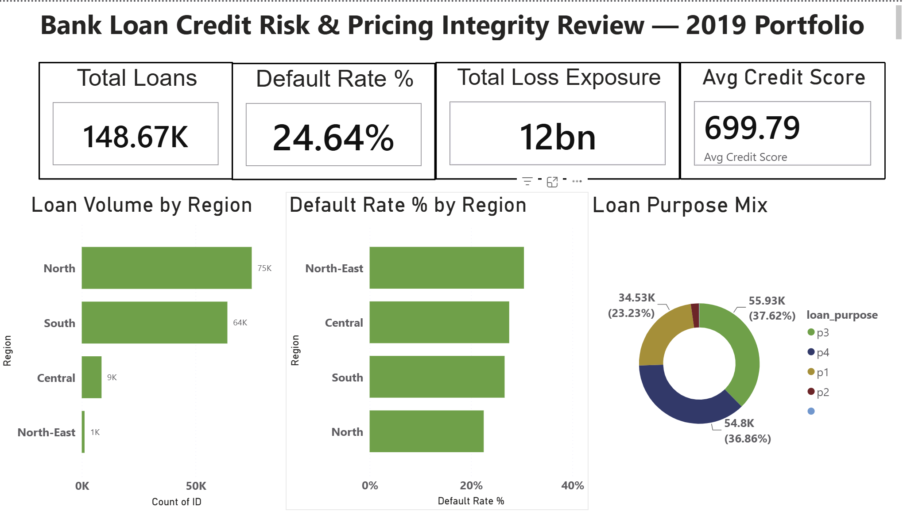
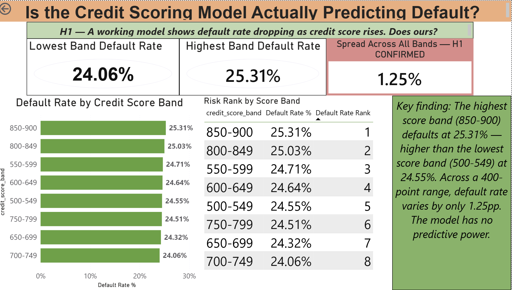
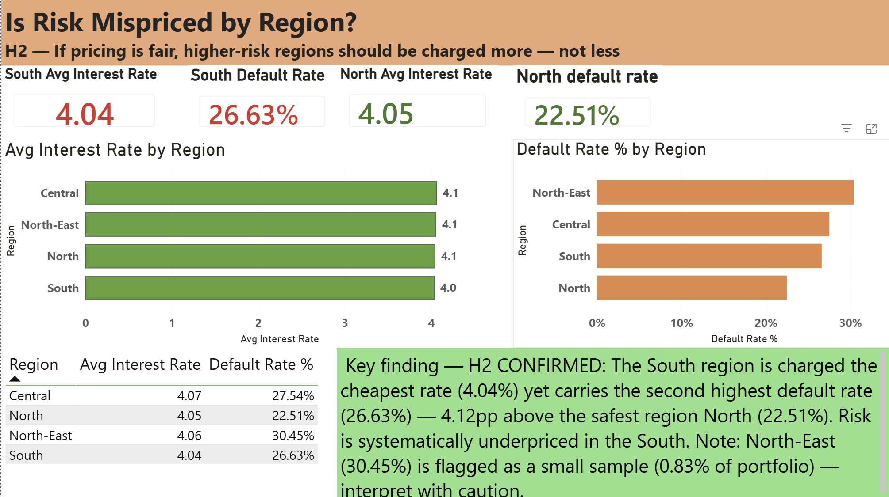
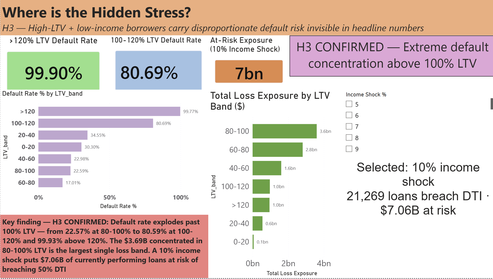
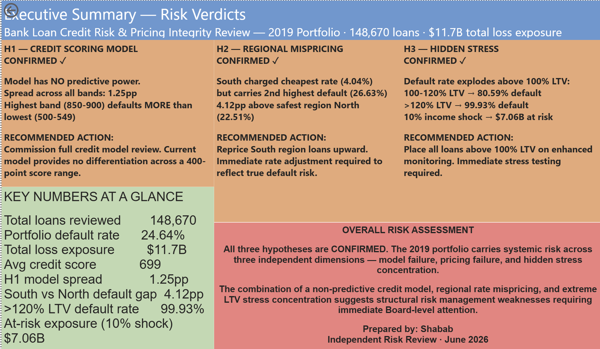
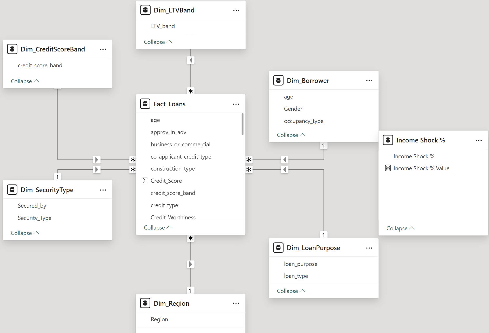

# Bank Loan Credit Risk & Pricing Integrity Review — 2019 Portfolio

[](https://www.microsoft.com/en-us/sql-server)
[](https://powerbi.microsoft.com/)
[](https://www.kaggle.com/)

## Project Overview

This project reviews a 2019 mortgage loan portfolio containing **148,670 loans** and approximately **$11.7B in total exposure**.

The aim was to look beyond the headline portfolio numbers and investigate three areas of credit risk: whether credit scores were separating higher-risk borrowers, whether interest rates were aligned with regional default risk, and whether high-LTV borrowers were creating hidden stress in the portfolio.

I used **SQL Server** for data cleaning, validation and analysis, then built a **5-page Power BI dashboard** to present the main findings.

---

## Business Problem

The analysis focused on three questions:

| # | Hypothesis | Question |
|---|---|---|
| H1 | Credit Scoring Model Integrity | Are higher credit scores actually associated with lower default rates? |
| H2 | Regional Rate Mispricing | Are borrowers with similar risk profiles being charged different rates across regions? |
| H3 | Hidden Stress Exposure | Are high-LTV and lower-income borrowers carrying more risk than the overall portfolio default rate suggests? |

---

## Key Findings

| Hypothesis | Result | Evidence |
|---|---|---|
| H1 | ✅ SUPPORTED | Default rates vary by only **1.25 percentage points** across a 400-point credit score range. The 850–900 score band records a **25.31%** default rate, compared with **24.55%** for the 500–549 band. Credit score bands show very little separation in observed default risk. |
| H2 | ✅ SUPPORTED | South has the **lowest average interest rate (4.04%)** but a **26.63% default rate**, 4.12 percentage points above North at 22.51%. The observed pricing does not appear closely aligned with regional default risk. |
| H3 | ✅ SUPPORTED | Default rates rise sharply above 100% LTV — **80.59%** at 100–120% LTV and **99.93%** above 120%. Under a 10% income-shock scenario, **$7.06B** of currently performing loans would move above a 50% DTI threshold. |

---

## Dashboard Gallery

### 1. Portfolio Overview



This page gives the starting point for the analysis: **148.67K loans**, a **24.64% default rate**, around **$12B in exposure**, and an average credit score of **699.79**.

The portfolio is heavily concentrated in North and South, which together account for around 94% of total loan volume. Loan purpose is also concentrated in categories p3 and p4.

The purpose of this page is to establish the overall portfolio before looking at the risk patterns underneath the averages.

### 2. Credit Score Model Integrity



This page compares default rates across eight 50-point credit score bands.

If credit score were strongly separating risk in this dataset, lower-score groups should generally show much higher default rates than higher-score groups. Instead, the results are almost flat.

Default rates range from roughly **24.06% to 25.31%**, a spread of only **1.25 percentage points** across the full 400-point score range.

The 850–900 band also records the highest default rate of the eight groups.

The result suggests that credit score alone is providing very little separation between lower- and higher-default groups in this portfolio.

### 3. Regional Rate Mispricing



This page compares average interest rates with actual default rates by region.

Average rates are tightly grouped between roughly **4.04% and 4.10%**, while default rates vary much more widely.

South has the lowest average rate at **4.04%**, but its default rate is **26.63%**, compared with **22.51%** in North.

South also contains **64,016 loans**, so the difference matters because it affects a large part of the portfolio.

North-East records an even higher default rate, but with only **1,235 loans**, the sample is much smaller and should be interpreted more carefully.

### 4. Hidden Stress Exposure



This page looks at default risk and exposure by loan-to-value band.

Default rates rise sharply once LTV moves above 100%, reaching around **80.69%** in the 100–120% band and almost **100%** above 120%.

However, the largest dollar concentration is actually in the **80–100% LTV band**, with around **$3.6B** in exposure.

The page also includes an income-shock scenario. With a **10% fall in income**, 21,269 currently performing loans representing approximately **$7.06B** in exposure would move above a 50% DTI threshold.

This shows why looking only at default rates can miss the amount of money concentrated in larger risk segments.

### 5. Executive Summary



The final page brings the three findings together in one place.

The main conclusion is that the portfolio shows three connected issues:

- credit score bands provide very little separation in default rates,
- interest rates do not appear closely aligned with regional default risk,
- and significant exposure is concentrated in higher-LTV borrowers.

The page summarises the evidence and the main areas that could be reviewed further.

---

## Power BI Data Model



The Power BI model uses a star-schema structure, with the main loan dataset connected to supporting dimension tables.

This keeps filtering consistent across the five dashboard pages and makes the model easier to maintain.

---

## Portfolio KPIs

| Metric | Value |
|---|---|
| Total Loans Reviewed | 148,670 |
| Portfolio Default Rate | 24.64% |
| Total Loss Exposure | $11.7B |
| Avg Credit Score | 699 |
| Avg LTV | 73.26% |
| Avg Interest Rate | 4.05% |
| Avg DTI | 37.73% |
| Avg Income | $6,885 |

---

## Tools & Technologies

| Tool | Purpose |
|---|---|
| SQL Server / SSMS | Database setup, staging, cleaning, EDA, analytical queries, views and stored procedures |
| Power BI Desktop | Star schema, DAX measures and 5-page dashboard |
| T-SQL | CTEs, window functions, statistical functions, BULK INSERT and BCP export |
| DAX | Default Rate %, Total Loss Exposure, Avg Interest Rate, Avg LTV, H1 Spread and At-Risk Exposure |

---

## Project Structure

```text
bank-loan-credit-risk-review/
├── README.md
├── DATA_DICTIONARY.md
├── KEY_FINDINGS.md
├── .gitignore
├── sql/
│   └── Phase2_SQL_Analysis.sql
├── powerbi/
│   └── BankLoanCreditRisk.pbix
├── data/
│   ├── Loan_Default.csv
│   └── Clean_LoanData.csv
└── screenshots/
    ├── 01_portfolio_overview.png
    ├── 02_h1_credit_score.png
    ├── 03_h2_rate_mispricing.png
    ├── 04_h3_stress_exposure.png
    └── 05_executive_summary.png
```

---

## SQL Phase — What Was Built

The SQL script (`Phase2_SQL_Analysis.sql`) covers the full workflow from raw data to analysis:

1. **Database Setup** — creates the `BankLoanCreditRisk` database
2. **Raw Staging Table** — `dbo.Raw_LoanData` keeps the original source structure for comparison and validation
3. **BULK INSERT** — loads all 148,670 records into SQL Server
4. **Data Cleaning** — creates `dbo.Clean_LoanData` with median imputation, standardised text fields, recalculated LTV and four derived columns
5. **EDA and Validation** — checks row counts, nulls, distributions and portfolio KPIs
6. **10 Analytical Queries** — 3 for H1, 4 for H2 and 3 for H3
7. **2 Reusable Views** — `vw_CreditScoreModelIntegrity` and `vw_RegionalPricingRisk`
8. **Stored Procedure** — `usp_ExecutiveRiskBriefing` returns the main portfolio findings and income-shock results

---

## SQL Data Pipeline & Analysis

The T-SQL script analyses **148,670 loans across 34 source columns**.

### Data Ingestion & Audit

- Creates the `BankLoanCreditRisk` database.
- Builds `dbo.Raw_LoanData` as a staging table matching the source file.
- Uses `BULK INSERT` to load the dataset.
- Checks row counts, null values and categorical consistency before cleaning.

### Data Cleaning & Feature Engineering

- Standardises regional naming.
- Replaces missing `loan_limit` values with `Unknown`.
- Imputes missing loan terms using the mode.
- Imputes missing property values and income using regional medians calculated with `PERCENTILE_CONT`.
- Recalculates loan-to-value using cleaned property values and `NULLIF` protection.
- Flags LTV values above 150% using `LTV_reliability_flag`.
- Creates 50-point credit score bands.
- Creates 20-point LTV bands for risk segmentation.
- Runs post-cleaning checks to confirm population totals and derived fields.

### Hypothesis-Driven SQL Analysis

| Hypothesis | SQL Analysis |
|---|---|
| H1 — Credit Score Model Integrity | Default rate by score band, risk ranking using `ROW_NUMBER()`, and spread testing using `STDEV` |
| H2 — Regional Rate Mispricing | Interest rate by region and score band, regional default comparisons, benchmark-gap analysis using CTEs, and sample-size checks |
| H3 — Hidden Stress Exposure | Default rate and exposure by LTV band, plus high-LTV and low-income segmentation using `NTILE(4)` income quartiles |

### SQL Techniques Used

- **CTEs and subqueries** for benchmark and segmented analysis
- **Window functions:** `ROW_NUMBER`, `NTILE` and `SUM() OVER()`
- **Statistical functions:** `PERCENTILE_CONT` and `STDEV`
- **Conditional aggregation:** `CASE WHEN` and grouped KPI calculations
- **Defensive SQL:** `ISNULL`, `NULLIF`, explicit casting and validation queries
- **Decision logic:** `CASE` and `EXISTS` statements used to return hypothesis results

### SQL Objects

| Object | Purpose |
|---|---|
| `vw_CreditScoreModelIntegrity` | Score-band default rates, pricing and risk ranking |
| `vw_RegionalPricingRisk` | Regional pricing and default-risk comparison with portfolio benchmarks |
| `usp_ExecutiveRiskBriefing` | Returns portfolio KPIs, H1–H3 analysis and income-shock results |

### Executive Risk Procedure

The stored procedure accepts an income-shock percentage and returns the portfolio overview, the three hypothesis results and the related DTI stress exposure.

```sql
EXEC dbo.usp_ExecutiveRiskBriefing @IncomeShockPct = 10.00;
```

---

## Power BI Phase — Dashboard Pages

| Page | Title | Content |
|---|---|---|
| 1 | Portfolio Overview | KPI cards, loan volume by region, default rate by region and loan purpose mix |
| 2 | Is the Credit Scoring Model Working? (H1) | Default rate by score band, risk ranking and score-band spread |
| 3 | Is Risk Mispriced by Region? (H2) | Interest rate vs default rate, regional comparison and South pricing analysis |
| 4 | Where is the Hidden Stress? (H3) | Default rate by LTV band, exposure by LTV band and income-shock scenario |
| 5 | Executive Summary — Risk Verdicts | Summary of the three findings, key numbers and recommended actions |

---

## Data Source

**Dataset:** [Loan Default — Kaggle](https://www.kaggle.com/)  
**Rows:** 148,670  
**Columns:** 34  
**Year:** 2019

---

## Recommended Actions

Based on the analysis, three areas would be worth reviewing further:

1. **Review the credit scoring approach** — default rates show very little separation across the eight score bands, so additional variables may be needed for stronger risk segmentation.

2. **Review regional pricing, particularly South** — South has a higher observed default rate than North while receiving the lowest average interest rate in the portfolio.

3. **Increase monitoring of very high-LTV loans** — loans above 100% LTV show much higher default rates, while the income-shock scenario also highlights significant exposure to borrowers that could move above a 50% DTI threshold.

These recommendations are based on patterns observed in this dataset and would require further validation before being used for real lending or pricing decisions.

---

## Author

**Shah Tahsin**  
Business Data Analyst | SQL · Power BI · Python  

[GitHub](https://github.com/shababtahsin)
